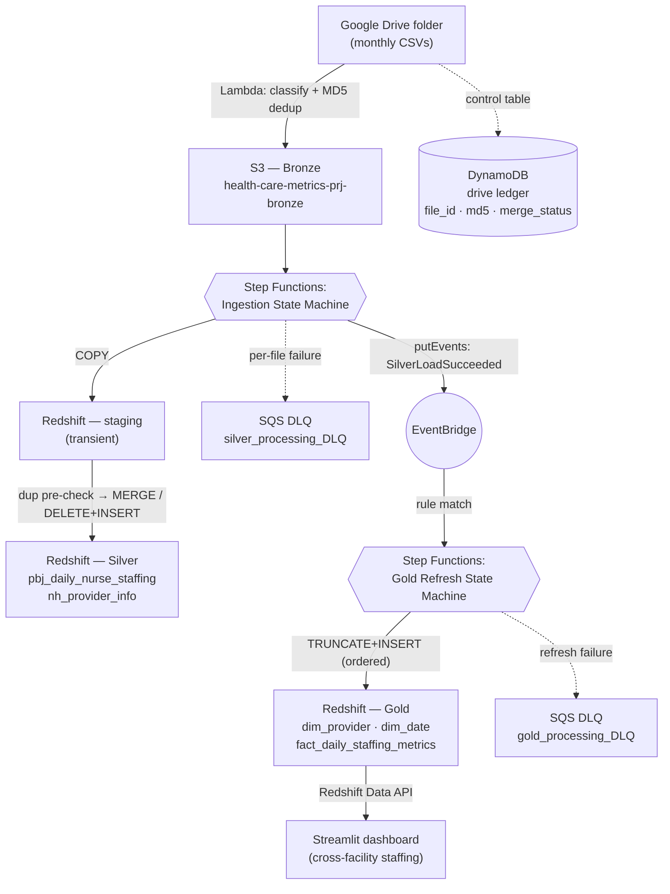
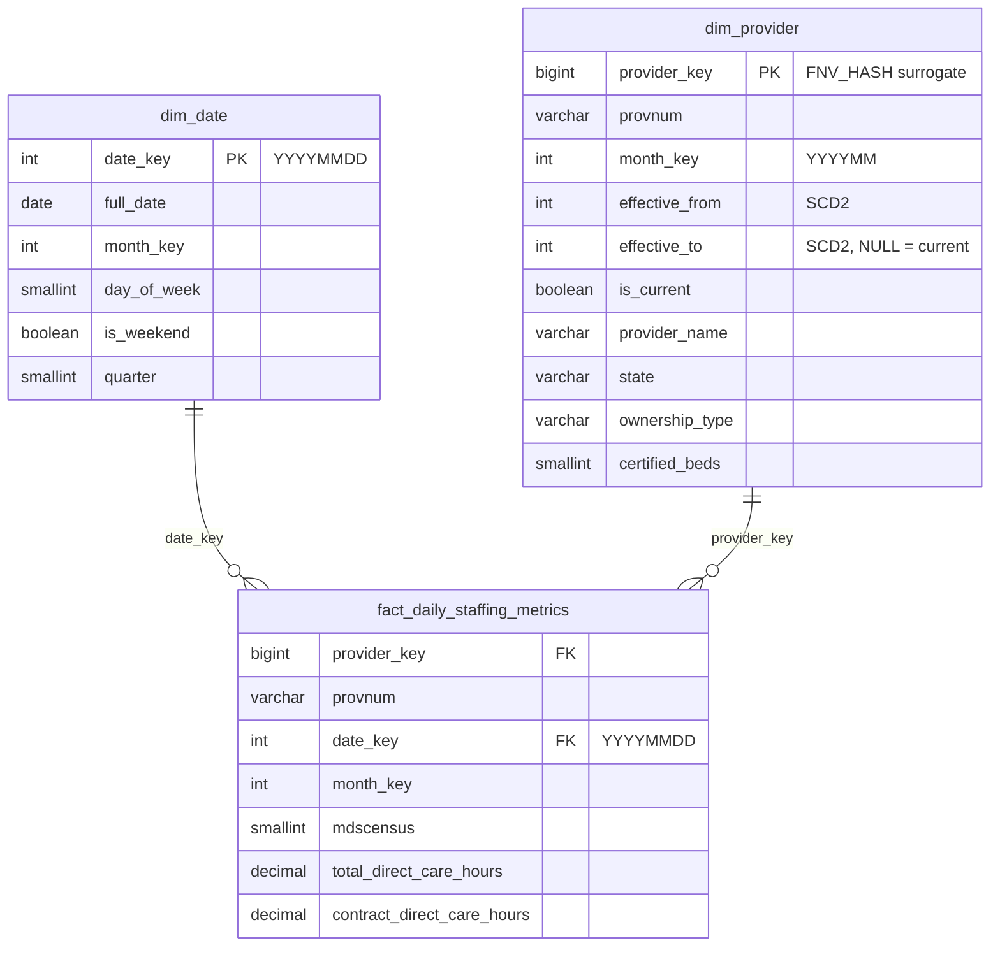

# Healthcare Metrics — CMS Nursing-Home Staffing & Quality Data Platform

An end-to-end, **event-driven data platform** that ingests CMS nursing-home
datasets from Google Drive, lands them in S3, transforms them through a
**Bronze → Silver → Gold medallion architecture** in Amazon Redshift Serverless,
and serves them through a **Streamlit** reporting layer.

The pipeline is built for **idempotency** (every stage is safe to re-run),
**data quality** (malformed files are quarantined before they can corrupt a
table), and **observability** (every failure is traced to a dead-letter queue
with a typed error code) — not just for moving bytes.

---

## Table of contents

- [What it does](#what-it-does)
- [Architecture](#architecture)
- [Data sources](#data-sources)
- [The medallion layers](#the-medallion-layers)
- [Event-driven orchestration](#event-driven-orchestration)
- [Data quality checks](#data-quality-checks)
- [Idempotency](#idempotency)
- [Error handling & dead-letter queues](#error-handling--dead-letter-queues)
- [Gold star schema](#gold-star-schema)
- [Reporting layer (Streamlit)](#reporting-layer-streamlit)
- [Repository layout](#repository-layout)
- [Tech stack](#tech-stack)
- [Running it](#running-it)

---

## What it does

CMS publishes two monthly nursing-home datasets that, joined together, answer a
regulator's core question: **is a facility staffing its residents adequately, and
how does that relate to its quality and enforcement history?** This platform
automates the full path from those raw files to an interactive comparison
dashboard:

1. **Ingest** new/changed CSVs from a Google Drive folder into S3 (Bronze),
   deduplicated by content hash.
2. **Clean & conform** them into typed, deduplicated Silver tables in Redshift.
3. **Curate** a Gold star schema (dimensions + facts) ready for BI.
4. **Report** cross-facility staffing metrics in Streamlit.

Each hop is triggered by the completion of the previous one — there are **no
schedules guessing whether upstream data is ready.**

---

## Architecture



The two state machines are decoupled by an **EventBridge event**: the ingestion
machine publishes `SilverLoadSucceeded` when it finishes, and an EventBridge rule
starts the gold refresh. Gold rebuilds *because Silver just changed*, never on a
timer.

---

## Data sources

Both are public CMS datasets, dropped into a Google Drive folder as CSVs. The
ingestion Lambda classifies each file **by filename** (unrecognized names are
rejected rather than guessed at):

| Dataset | Filename pattern | Grain | Silver table |
|---|---|---|---|
| **PBJ Daily Nurse Staffing** | `PBJ_Daily_Nurse_Staffing_*.csv` | one row per **provider × day** | `silver.pbj_daily_nurse_staffing` |
| **NH Provider Info** | `NH_ProviderInfo_<Mon><YYYY>.csv` | one row per **provider × month** (full snapshot) | `silver.nh_provider_info` |

For NH Provider Info, the month is derived from the **filename** (e.g.
`NH_ProviderInfo_Oct2024.csv` → `snapshot_date_key = 20241001`), *not* the file's
modified time — so a late re-upload of a corrected old month still lands under
that old month.

---

## The medallion layers

| Layer | Store | Contents | Load pattern |
|---|---|---|---|
| **Bronze** | S3 | Raw CSVs exactly as received, timestamped from Drive's `modifiedTime` | Immutable object write |
| **Staging** | Redshift `staging` | Transient landing tables, truncated before/after each file | `COPY` from S3 |
| **Silver** | Redshift `silver` | Cleaned, typed, **deduplicated** per-source tables with lineage columns | PBJ: `MERGE` (upsert) · NH: scoped `DELETE`+`INSERT` |
| **Gold** | Redshift `gold` | Conformed **star schema** (dims + facts) for BI | Full `TRUNCATE`+`INSERT` rebuild |

Every Silver/Gold row carries **lineage columns** (`_source_s3_key`,
`_drive_modified_at`, `_md5hash`, `_loaded_at` / `_refreshed_at`) so any value can
be traced back to the exact source file version that produced it.

---

## Event-driven orchestration

### 1. Ingestion Lambda — Google Drive → S3 (Bronze)

[`gdrive_to_s3_lambda.py`](gdrive_to_s3_lambda.py)

- Lists CSVs in the Drive folder, classifies each by filename, derives a
  `snapshot_date_key` for monthly snapshots.
- Computes the file's **MD5** and consults the **DynamoDB control table**
  (`healthcare_metrics_source_drive_ledger`, keyed on `file_id`):

  | Control-table state | Action |
  |---|---|
  | not present | **new** → download + upload to S3 |
  | same md5, `merge_status = SUCCESS` | **skip** (already in Silver) |
  | same md5, `merge_status ≠ SUCCESS` | **re-offer** (last merge never confirmed) |
  | different md5 | **changed** → re-upload |

- Uploads to S3 as `<name>_<driveModifiedTime>.csv` and upserts the control record
  as `PENDING`. The Step Function later flips this to `SUCCESS`/`FAILED`, so a
  merge that fails *after* the Lambda ran isn't silently treated as "already
  processed" next time.

### 2. Ingestion State Machine — Bronze → Silver

[`step_functions/healthcare_metrics_ingestion_state_machine.json`](step_functions/healthcare_metrics_ingestion_state_machine.json)

Processes files one at a time (`MaxConcurrency: 1`), routing each by `file_type`.
Per file:

```
Truncate staging → COPY from S3 → duplicate-key pre-check
    → MERGE / DELETE+INSERT into Silver → mark merge_status in DynamoDB
    → cleanup staging
```

Every branch (COPY, pre-check, merge/load) has bounded retries and a `Catch` that
records `merge_status = FAILED` in DynamoDB **and** routes the file to the DLQ
with a typed `error_type`, so a failure is never silently lost. On completion the
machine publishes the `SilverLoadSucceeded` EventBridge event that triggers Gold.

### 3. Gold Refresh State Machine — Silver → Gold

[`step_functions/healthcare_metrics_gold_refresh_state_machine.json`](step_functions/healthcare_metrics_gold_refresh_state_machine.json)

Triggered by the EventBridge rule. Rebuilds the gold layer with **ordered**
stored-proc calls: `dim_provider` **first**, then `fact_daily_staffing_metrics`
(the fact resolves its `provider_key` by joining `dim_provider`, so the dimension
must be rebuilt first — running them concurrently would resolve every key to the
`-1` Unknown member). Failures route to a separate `gold_processing_DLQ`.

> The `fact_provider_quality_metrics` refresh is temporarily disabled in the live
> state machine (to test the staffing path in isolation); its table and stored
> proc still exist and are documented for re-enablement as a second concurrent
> branch.

---

## Data quality checks

Quality is enforced in **layers**, so a bad file is stopped at the earliest point
possible and can never corrupt a Silver/Gold table:

1. **Filename classification** (Lambda) — a file whose name matches no known
   convention is rejected to `errors` rather than guessed into the wrong table.
2. **Content-hash dedup** (Lambda + DynamoDB) — unchanged, already-merged files
   are skipped by MD5.
3. **Duplicate-key pre-check** (State Machine) — before any merge runs,
   `CheckPbjDuplicates` / `CheckNhDuplicates` query staging for duplicate business
   keys (`provnum + workdate` / `provnum`). Because lineage is constant within one
   file, a duplicate key means the **file is malformed** — it's routed straight to
   the DLQ, never merged.
4. **In-procedure dedup guard** (Stored procs) — a second, belt-and-suspenders
   `ROW_NUMBER() … = 1` dedup inside every Silver proc guarantees exactly one row
   per key reaches the target, independent of the pre-check.
5. **Robust `COPY` options** — `BLANKSASNULL`, `EMPTYASNULL`, `ACCEPTINVCHARS`
   (tolerates Windows-1252 bytes from Excel-exported CSVs), `MAXERROR 0`.
6. **NULL-safe SCD2 comparison** — `dim_provider` uses `IS DISTINCT FROM` so a
   NULL attribute change is detected correctly.
7. **Typed error classification** — data errors (`invalid`, `out of range`, `type
   mismatch`, `constraint`, `numeric`, …) are re-raised with a `DATA_ERROR` prefix
   so the state machine sends them to the DLQ **without retrying** (bad data won't
   fix itself), while transient errors get bounded retries.

---

## Idempotency

Every stage is safe to re-run — a retry, a replay, or a full reprocess produces
the same result:

| Stage | Mechanism |
|---|---|
| **Drive → S3** | MD5 + `merge_status` in DynamoDB; unchanged+merged files are skipped |
| **Silver — PBJ** | `MERGE` (upsert) on `provnum + workdate` with a deterministic last-writer-wins rule (tiebreak: `drive_modified_at`, then `md5hash`) |
| **Silver — NH** | Scoped `DELETE` (this month + this file's providers) + `INSERT`, in one transaction — no window where the month is empty |
| **Gold** | Full `TRUNCATE` + `INSERT`; surrogate keys use `FNV_HASH(provnum || '_' || month_key)` so the **same logical row gets the same key on every rebuild** (unlike an `IDENTITY`, which would churn keys) |

Because Silver's NH loader only ever touches the *current* month, Silver retains
full monthly history forever — which is what lets Gold recompute SCD2
`effective_from`/`effective_to`/`is_current` from scratch on every full rebuild,
with no incremental "what changed since last run" state to maintain.

---

## Error handling & dead-letter queues

- **Two SQS DLQs** — `silver_processing_DLQ` and `gold_processing_DLQ` — keep
  ingestion failures separate from transformation failures.
- Every DLQ message carries a typed `error_type` attribute
  (`UNKNOWN_FILE_TYPE`, `PBJ_DUPLICATE_KEY`, `COPY_FAILED`, `MERGE_FAILED`,
  `DIM_PROVIDER_REFRESH_FAILED`, …) for fast triage.
- Even failures *inside the Lambda* (bad classification, Drive download error) are
  swept to the DLQ by a dedicated Map branch, so nothing vanishes without a trace.
- A failed gold-trigger publish is itself traced to the DLQ but self-heals — the
  next successful ingestion run rebuilds Gold from everything currently in Silver.

---

## Gold star schema



- **`dim_provider`** — monthly snapshot of provider attributes with **SCD Type 2**
  version metadata; kept at `provnum + month_key` grain so facts join with a plain
  equi-join. Seeds a `-1` **"Unknown" member** for orphaned staffing rows.
- **`dim_date`** — day-grain calendar (`DISTSTYLE ALL`).
- **`fact_daily_staffing_metrics`** — day-grain staffing measures. Carries **raw
  building blocks only** (census, total/contract direct-care hours); ratios (HPRD,
  contract mix) are derived in the reporting layer.
- **`fact_provider_quality_metrics`** — monthly ratings/turnover/deficiencies/
  penalties (table + proc exist; refresh currently disabled).

---

## Reporting layer (Streamlit)

[`streamlit_app/`](streamlit_app/) — a regulator-facing **cross-facility staffing
dashboard** reading Gold over the **Redshift Data API** (same
workgroup/database/secret as the pipeline; no open database port).

- Derives **HPRD** (`Σ direct-care hours / Σ census`), **contract mix**, and
  **contract reliance** (`Σ contract hours / certified beds`) from the Gold fact's
  raw measures.
- Only the **month-range** filter hits Redshift (cached per range); state /
  ownership / provider-type filters run client-side in pandas, so they're instant.
- Tabs: **Overview** (distributions + scatter), **By state** (US choropleth),
  **Rankings**, **Trend**, **Outliers** (understaffing flags).
- Uses a validated **colorblind-safe** Plotly palette.

See [`streamlit_app/README.md`](streamlit_app/README.md) for run instructions.

---

## Repository layout

```
.
├── gdrive_to_s3_lambda.py            # Ingestion Lambda: Drive → S3 + DynamoDB dedup
├── requirements_lambda.txt
├── redshift/
│   ├── ddl/                          # Schemas + staging/silver/gold table DDL
│   └── stored_procs/                 # COPY / MERGE / load / gold-refresh procedures
├── step_functions/
│   ├── healthcare_metrics_ingestion_state_machine.json    # Bronze → Silver
│   └── healthcare_metrics_gold_refresh_state_machine.json # Silver → Gold
├── streamlit_app/                    # Reporting dashboard (Redshift Data API)
└── Exploratory Data Analysis/        # Early Snowflake-based EDA / staging scripts
```

---

## Tech stack

- **AWS**: Lambda, Step Functions, EventBridge, S3, SQS, DynamoDB, Secrets
  Manager, **Redshift Serverless** (Redshift Data API)
- **Languages**: Python (Lambda + Streamlit), PL/pgSQL (Redshift stored procs), SQL
- **Reporting**: Streamlit + Plotly + pandas
- **Source APIs**: Google Drive API (service-account auth)

---

## Running it

- **Redshift objects** — apply `redshift/ddl/*.sql` (numbered in order), then
  `redshift/stored_procs/*.sql`.
- **Lambda** — package with `requirements_lambda.txt`; fill the placeholder
  Drive folder / S3 bucket / DynamoDB table / secret names at the top of
  `gdrive_to_s3_lambda.py`.
- **State machines** — deploy both JSON definitions; add the EventBridge rule
  matching `source = healthcare.metrics.ingestion`, `detail-type =
  SilverLoadSucceeded` to start the gold refresh.
- **Dashboard** — see [`streamlit_app/README.md`](streamlit_app/README.md).
```bash
cd streamlit_app && pip install -r requirements.txt && streamlit run app.py
```
